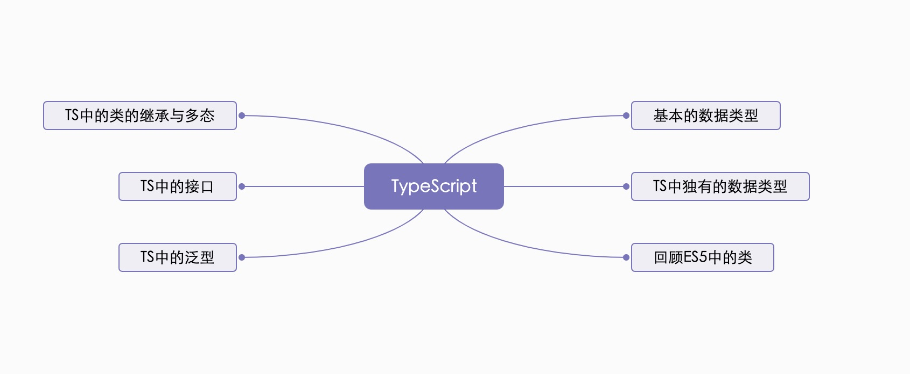

# TypeScript尝鲜

- TS是JavaScript的超集，遵循ES5与ES6的规范，并且拓展了JS语法。
- TS更像后端的Java与C#这样面向对象的语言，能够更好的应对企业级的开发。
- Google也在同微软一起大力支持TS的推广，最新的NG框架也基于TS开发。
- 最新的React与Vue也集成了TS，即将到来的Vue3也在基于TS开发。

## 起步：安装与编译

安装

```shell
npm install -g typescript
```

创建一个`helloworld.ts`文件

```ts
console.log('Hello TypeScript')
```

编译第一个文件

```shell
tsc helloworld.ts
```

编译完成之后，出现了一个js文件，是被编译过后浏览器能识别的JS文件

### VScode：强大的TS工具

创建tsconfig.json文件

```shell
tsc --init
```

点击菜单，任务--运行任务，点击tsc:监视-tsconfig.json就可以自动生成代码了

::: tip
在tsconfig.json中，我们需要指定编译成的js文件的路径。去掉`"outDir": "./"`的注释，这里的默认路径是TS文件的水平目录，我们可以自己指定:ok_hand:
:::

## 接下来需要掌握的知识点

