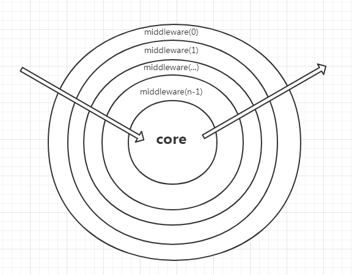

# 为什么是洋葱模型

现在我们稍微的修改一下中间件的函数，让其稍微的复杂一点

```js
app.use((ctx, next) => {
  console.log(1)
  next()
  console.log(2)
})

app.use((ctx, next) => {
  console.log(3)
  next()
  console.log(4)
})
```

验证其得到的打印结果为：1 3 4 2

## 洋葱图



我们可以根据代码，看到了`next`将函数进行了分层。对应到图中，服务器在执行的时候，从最外层开始开始，遇到了`next`函数，进入下一层，又遇到`next`，又进入下一层，直到执行完毕。然后下一步我们执行被`next`分割完之后的部分的代码，执行完毕后，又向外一层执行外层未执行完毕的代码。

## 可能存在的隐患

在使用中间件的时候注意两点：

- 中间件的函数前面加上`async`
- 在`next`前面加上`await`

```js
app.use(async (ctx, next) => {
  console.log(1)
  await next()
  console.log(2)
})

app.use(async (ctx, next) => {
  console.log(3)
  await next()
  console.log(4)
})
```

::: warning
因为在nodeJS中使用了大量的异步的代码，异步相较于同步比较难以维护与理解。如果不加上`async`与`await`我们很难保证其按照顺序执行洋葱模型。:onion:
:::