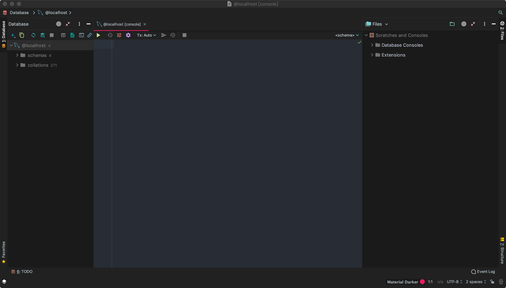
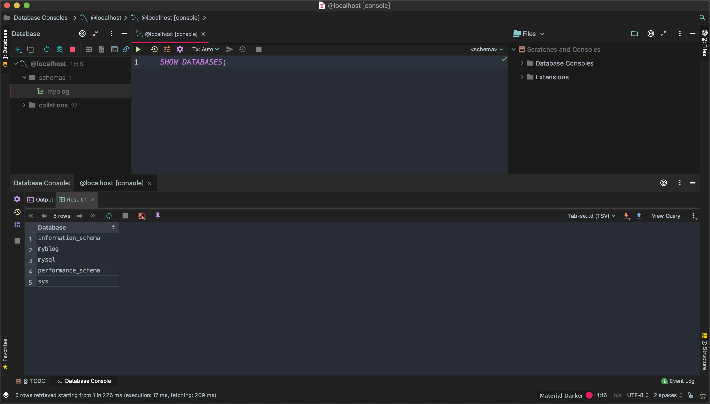
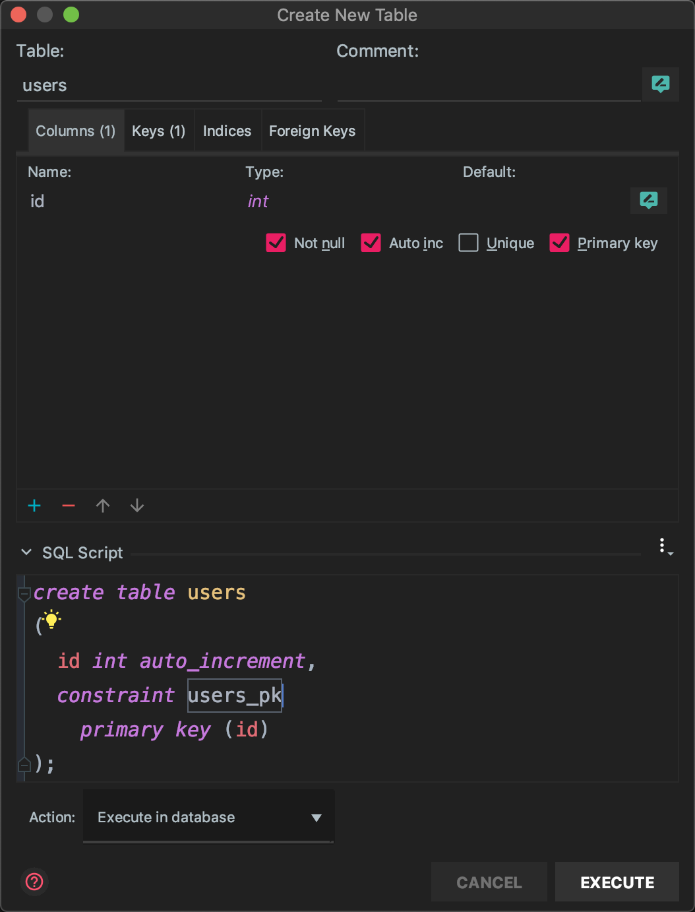
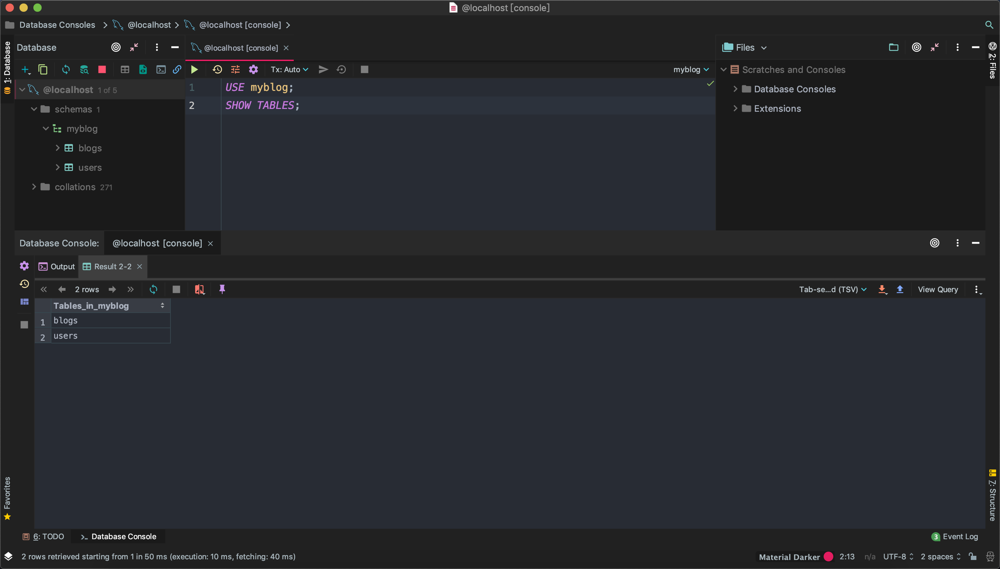
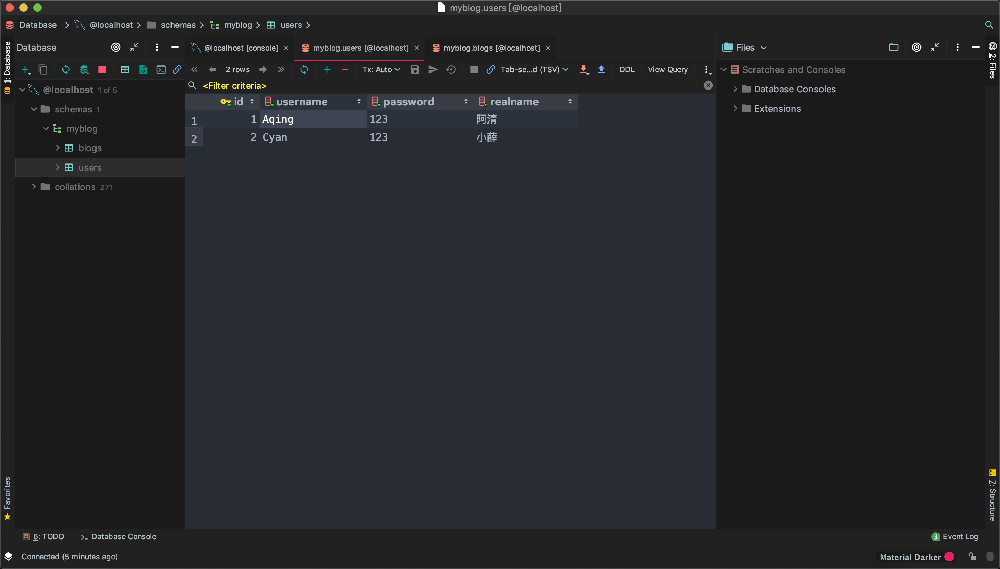

# MySql的引入

::: tip
选择mysql而不是mogonDB的原因：

- mysql是企业内最常用的存储工具，一般都有专人维护
- mysql也是社区内最常用的存储工具，有问题随时可查
- 关系型数据库比较适合博客项目的读写
- 后续博客会对SQL数据库做一个深入的入门学习
:::

## SQL前言

我们现在假设你已经安装好了mysql，我们就可以使用node来操作mysql，在此之前，我们使用图形化的工具来简单的学习一下sql语句

推荐使用[DateGrip](https://www.jetbrains.com/datagrip/)，当然其他的图形化工具都可以，直接使用命令行操作也可以。

## 基本操作

这一部分的内容不要跳过，我们在练习基本操作的时候，就顺便把博客系统需要使用到的数据库创建并写入初始的数据

### 建库

使用工具连接好数据库后，我们点击加号，创建一个新的`schema`，我们可以看到执行的SQL语句是`CREATE SCHEMA 'myblog';`



我们执行`SHOW DATABASES;`，查看所有数据库，可以看到我们创建的数据库成功了



::: tip
SQL语句官方建议大写，并且每一句后面带上`;` 虽然工具中使用小写不带分号都可以，但我们尽量保证标准规范。:ok_hand:
:::

### 建表

我们需要建立两张表来存储数据，分别存储用户信息，以及博客文章

| id  | username | password | realname |
| --- | -------- | -------- | -------- |
| 1   | Aqing    | 123      | 阿清     |
| 2   | Cyan     | 123      | 小薛     |

| id  | title | content | createtime    | author |
| --- | ----- | ------- | ------------- | ------ |
| 1   | 标题1 | 内容1   | 1557147594030 | Aqing  |
| 2   | 标题2 | 内容2   | 1557147621152 | Cyan   |

建表的时候，我们实际建立的是表结构，在表结构建立好了之后才插入表内容，表结构如下

user表结构：

- colum指列名称，例如id一列，username一列等等
- datatye指该列数据的类型，int类型就是数字，varchar类型就行字符串类型，括号内的数据是限长
- pk主键指的是该列所有行的数据是否能重复，Y就是不能重复
- nn不为空：该列的值不能为空
- AI自动增加：这个数据会自动生成，基于1开始自动增加，保证不会重复，不需要我们手动插入
- Default：默认值

| colum    | datatye     | pk主键 | nn不为空 | AI自动增加 | Default |
| -------- | ----------- | ------ | -------- | ---------- | ------- |
| id       | int         | Y      | Y        | Y          |         |
| username | varchar(20) |        | Y        |            |         |
| password | varchar(20) |        | Y        |            |         |
| realname | varchar(10) |        | Y        |            |         |

blogs表结构

| colum      | datatye     | pk主键 | nn不为空 | AI自动增加 | Default |
| ---------- | ----------- | ------ | -------- | ---------- | ------- |
| id         | int         | Y      | Y        | Y          |         |
| title      | varchar(50) |        | Y        |            |         |
| content    | longtext    |        | Y        |            |         |
| createtime | bigint(20)  |        | Y        |            | 0       |
| author     | varchar(20) |        | Y        |            |         |

> 我们依然用工具创建（提高效率）

在`myblog`上右键，创建一个`Table`，工具本质还是替我们执行了sql语句，按照这个格式对比上表，一个一个创建列



### 操作表（增删改查）

首先我们需要使用我们创建的数据库，输入`USE myblog;`，再显示我们所有的表`SHOW TABLES;`



插入数据

```sql
INSERT INTO users(username, password, realname)
VALUES ('Aqing', 123, '阿清');
INSERT INTO users(username, password, realname)
VALUES ('Cyan', 123, '小薛');
```



::: warning
运行SQL语句时，记得注释掉前面的插入语句，不然会反复插入相同的信息到表中
:::

查询数据：现在我们看看插入的数据是否ok，分别执行下面的语句看看异同

```sql
SELECT * FROM users;
SELECT * FROM users WHERE username='Aqing';
```

### 更新数据

```sql
UPDATE users SET realname='老薛' WHERE username='Cyan';
```

### 删除

```sql
DELETE from users WHERE username='Aqing';
```

但是这样的删除或许有点暴躁，我们可以修改一下表结构

```sql
alter table users
add state int default 1 not null;
```

现在我们的表结构就变成了每一行附带一个`state`信息，默认为1，在这个情况下我们约定，state为1的数据是可以用的。

```sql
SELECT * FROM users WHERE state='1';
```

如果我们要删除数据，就把它的`state`置为0，进行一个假装删除。

::: tip
这种不是完全的删除行为，是一种**软删除**的行为，不会真正的完全删除数据，只是约定中置换了状态进行了删除。我们在某些情况下还能恢复。本次项目中，**我们就不使用软删除了**，此处仅做了解。
:::

我们顺便把博客的初始数据也插入一下

```sql
INSERT INTO blogs (title, content, createtime, author)
VALUES ('标题A', '内容A', 1557151669833, 'Aqing');

INSERT INTO blogs (title, content, createtime, author)
VALUES ('标题B', '内容B', 1557151701315, 'Cyan');
```

> 下一节，我们就开始使用node操作MySql数据库